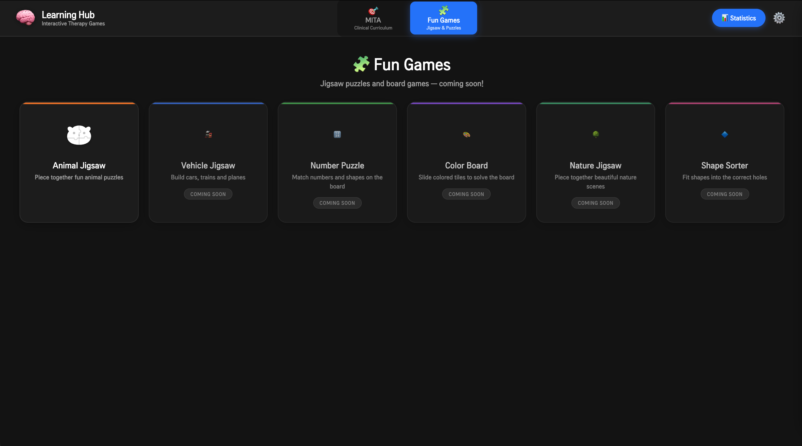
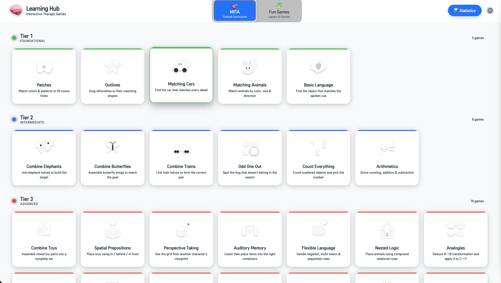
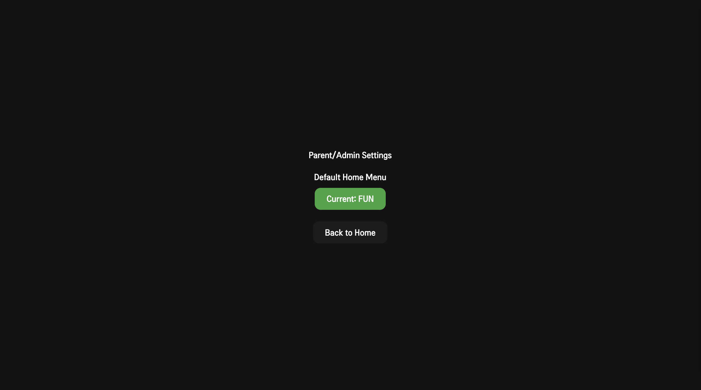
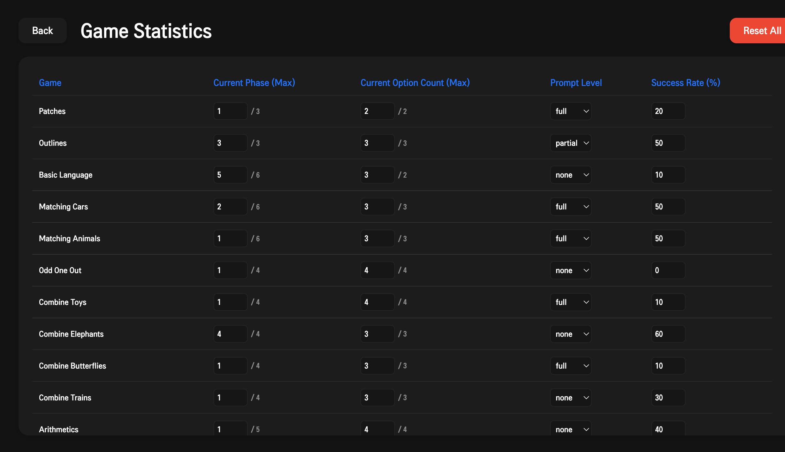

# YAGC — Yet Another Game Collection

> *To my son: May you always grow up happy, healthy, and surrounded by love.* ❤️
> 
> A versatile, interactive game collection built for my son to play on the **LG StanbyME 27" webOS touchscreen**. 
> While it features a wide variety of general puzzles and fun games suitable for any child, it proudly includes a dedicated clinical section that implements the full [ImagiRation MITA](https://imagiration.com/autism/mita-games/) therapeutic curriculum, utilizing ABA (Applied Behaviour Analysis) principles to support cognitive training.

## 🙏 Acknowledgments

A heartfelt thank you to **ImagiRation** for their incredible foundational work in this space. By openly publishing their [game ideas](https://imagiration.com/autism/mita-games/) and sharing their clinical findings, they made this bespoke open-source implementation possible. 

We highly recommend reading their original academic research:
> 📖 **["Mental Imagery Therapy for Autism (MITA) - An Early Intervention Computerized Brain Training Program for Children with ASD"](https://www.researchgate.net/publication/287147313_Mental_Imagery_Therapy_for_Autism_MITA_-_An_Early_Intervention_Computerized_Brain_Training_Program_for_Children_with_ASD)**

---

## Screenshots

<div align="center">
  
  
  
  
</div>

---

## Table of Contents

1. [Project Overview](#project-overview)
2. [Tech Stack](#tech-stack)
3. [Getting Started](#getting-started)
4. [Project Structure](#project-structure)
5. [Architecture](#architecture)
   - [Stores](#stores)
   - [Composables](#composables)
   - [Components](#components)
6. [Game Modules](#game-modules)
   - [Fun Games](#fun-games)
   - [Tier 1 — Foundational](#tier-1--foundational)
   - [Tier 2 — Intermediate](#tier-2--intermediate)
   - [Tier 3 — Advanced](#tier-3--advanced)
7. [Clinical Design Principles](#clinical-design-principles)
8. [Deployment to webOS](#deployment-to-webos)
9. [Type Reference](#type-reference)

---

## Project Overview

YAGC is a **Vue 3 SPA** built as an expansive collection of games. It is designed to run on an LG StanbyME TV acting as a large-format touchscreen, but it can also run on other touchscreen devices running WebOS.

The application is split into two main sections:
1. **Fun Games:** A growing collection of traditional childhood puzzles, such as interlocking animal jigsaws, shape sorters, and color boards, designed for casual play and fine motor skill development.
2. **MITA Clinical Curriculum:** A structured sequence of interactive therapy games across three tiers of cognitive difficulty.

Every game module in the clinical section shares:
- **ABA Prompt Fading** — automatic scaffolding that progresses from full visual hints → partial hints → no hints
- **Procedural level generation** — each session generates fresh content, preventing memorisation
- **Web Speech API** — all instructions are spoken aloud; the child listens before interacting
- **Persistent progress** — stats survive page reloads via `localStorage`

### 🎨 Global Theme Switching

YAGC supports a fully dynamic, independent global theme system. You can set a unique theme for the **MITA Games** curriculum (e.g., *Dark Mode* to reduce distractions) and a separate theme for **Fun Games** (e.g., *Colorful* or *Light*). 

**How to set the theme:**
1. Navigate to the **Settings** menu (gear icon on the home screen).
2. Under "MITA Game Theme", select your preferred theme for clinical exercises (Light, Dark, or Colorful).
3. Under "Fun Game Theme", select a theme for casual puzzles.
4. Your choices are automatically persisted and instantly applied to both the game menus and inside every individual game board!

---

## Tech Stack

| Layer | Technology |
|---|---|
| Framework | Vue 3 `<script setup>` + TypeScript |
| Build | Vite 8 + `vue-tsc` |
| State | Pinia + `pinia-plugin-persistedstate` |
| Routing | Vue Router 5 |
| Audio | Web Speech API (`window.speechSynthesis`) |
| Platform SDK | `webostvjs` (LG webOS TV JS SDK) |
| Styling | Scoped Vanilla CSS (no Tailwind, no CSS frameworks) |
| Deployment | `ares-package` / `ares-launch` via LG webOS CLI |

### Scripts

```bash
npm run dev       # Vite dev server (hot reload)
npm run build     # vue-tsc type check → vite production build → dist/
npm run preview   # Preview the production build locally
```

---

## Getting Started

### Prerequisites

- Node.js ≥ 20
- LG webOS CLI (`ares-setup-device`, `ares-launch`)
- webOS TV 24 Simulator (optional, for local testing)

### Install & Run

```bash
git clone <repo>
cd YAGC
npm install
npm run dev
```

### Build & Deploy to Simulator

```bash
npm run build
ares-launch "./dist" -s 24 \
  -sp /path/to/webOS_TV_24_Simulator_1.4.1
```

### Build & Deploy to Physical Device

```bash
npm run build
ares-package ./dist -o ./build --no-minify
ares-install ./build/yagc_0.0.15_all.ipk -d <device-name>
ares-launch yagc -d <device-name>
```

---

## Project Structure

```
src/
├── assets/                      # Static resources and global stylesheets
├── components/
│   ├── game/                    # Reusable game primitives
│   │   ├── AnimalAsset.vue      # SVG animals (30 shapes × size/color/direction)
│   │   ├── AssetLibrary.vue     # Generic SVG noun renderer (58 vocabulary items)
│   │   ├── BugAsset.vue         # SVG bugs (beetle, butterfly, caterpillar, ladybug, bee)
│   │   ├── ButterflyAsset.vue   # Butterfly halves for Combine Butterflies
│   │   ├── CarAsset.vue         # SVG cars (sedan, truck, beetle, van, sports, bus)
│   │   ├── ElephantAsset.vue    # Elephant halves for Combine Elephants
│   │   ├── JarAsset.vue         # Container asset (Auditory Memory)
│   │   ├── MenuIcon.vue         # Dynamic SVG icons for each game's start screen
│   │   ├── NumberCard.vue       # Numeric answer card
│   │   ├── ObjectGroupAsset.vue # Grouped item renders (Count Everything)
│   │   ├── PerspectiveCompositeAsset.vue  # Toy+vehicle with viewpoint transform
│   │   ├── PuzzlePiece.vue      # Touch drag-and-drop wrapper (all games)
│   │   ├── SearchItemAsset.vue  # Tappable search field item (Selective Attention)
│   │   ├── SpatialCompositeAsset.vue      # Toy+vehicle with spatial preposition
│   │   ├── SvgSceneGenerator.vue          # 8-scene procedural SVG for Patches
│   │   ├── TrainAsset.vue       # Train halves for Combine Trains
│   │   └── TransportCompositeAsset.vue    # Stacked rider-on-carrier (Carries or Rides)
│   └── prompts/
│       └── PointingHand.vue     # ABA "full" prompt animation overlay
├── composables/
│   ├── useLogger.ts             # Structured per-module event logging
│   ├── usePromptFading.ts       # ABA Time-Delay prompt state machine
│   ├── useProceduralGen.ts      # Shared procedural content generation helpers
│   ├── useSafeTimeout.ts        # Auto-cleared setTimeout (prevents stale callbacks)
│   ├── useSpeech.ts             # Web Speech API wrapper
│   └── useTouchDrag.ts          # Touch/mouse drag engine with layering & hit-box logic
├── modules/
│   ├── fun/
│   │   ├── AnimalJigsaw/        # Progressive interlocking animal puzzle
│   │   ├── CategoryBins/        # Thematic sorting and categorization
│   │   ├── ColorBoard/          # Color recognition and grid matching
│   │   ├── ConnectDots/         # Number sequencing and drawing
│   │   ├── MemoryMatch/         # Classic card-flipping memory game
│   │   ├── NatureJigsaw/        # Progressive interlocking nature puzzle
│   │   ├── NumberPuzzle/        # Number recognition and ordering
│   │   ├── PatternTrain/        # Visual sequencing and pattern completion
│   │   ├── ShadowMatch/         # Visual discrimination with silhouettes
│   │   ├── ShapeSorter/         # Geometry and shape matching
│   │   ├── SizeSorter/          # Physical stacking from biggest to smallest
│   │   └── VehicleJigsaw/       # Progressive interlocking vehicle puzzle
│   ├── tier1/
│   │   ├── BasicLanguage/       # Language Comprehension (6 phases)
│   │   ├── MatchingAnimals/     # Animal visual discrimination
│   │   ├── MatchingCars/        # Car visual discrimination
│   │   ├── Outlines/            # Shape silhouette matching (3 phases)
│   │   └── Patches/             # Color & pattern matching (3 phases, 8 scenes)
│   ├── tier2/
│   │   ├── Arithmetics/         # Counting, addition, subtraction
│   │   ├── CombineButterflies/  # Butterfly assembly puzzle
│   │   ├── CombineElephants/    # Elephant assembly puzzle
│   │   ├── CombineTrains/       # Train assembly puzzle
│   │   ├── CountEverything/     # Object counting & number selection
│   │   └── OddOneOut/           # Find the anomaly in a swarm
│   └── tier3/
│       ├── Analogies/           # A→B rule deduction → apply to C→D
│       ├── AuditoryMemory/      # Place items in containers from memory
│       ├── CarriesOrRides/      # Thematic role: carrier vs. rider
│       ├── CarriesOrRidesMemory/# Same + hidden options during audio
│       ├── CatchUpGameMemory/   # Race winner from grammar + memory
│       ├── CombineToys/         # Multi-part toy assembly from mixed pools
│       ├── FlexibleLanguageMemory/ # Negation, multi-select, sequential placement
│       ├── NestedLogic/         # Recursive spatial placement in a grid
│       ├── PassiveVerbTense/    # Active/passive grammar (race winner)
│       ├── PerspectiveTaking/   # Spatial grid from another character's POV
│       ├── SelectiveAttention/  # Visual search: tap all targets in crowded field
│       ├── SpatialPrepositions/ # Drag toy to correct vehicle slot (in/behind/in_front)
│       ├── SubjectObject/       # Garden hose: who gets wet? (active/passive)
│       ├── SubjectObjectMemory/ # Same + hidden options during audio
│       ├── TimePrepositions/    # Chronological sequencing (before/after)
│       └── TimePrepositionsMemory/ # Same + hidden options during audio
├── stores/
│   ├── useGameStore.ts          # Session-level game state
│   ├── useProgressStore.ts      # Cross-session progress (persisted)
│   └── useSessionStore.ts       # Ephemeral session state (e.g., last active tab)
├── utils/
│   └── shuffle.ts               # Array randomization utilities
├── views/
│   ├── GlobalMenu.vue           # Main landing page for Fun vs MITA selection
│   ├── GameSelectionMenu.vue    # Game selection grid for the chosen section
│   ├── GameView.vue             # Wrapper for dynamically loading game modules
│   ├── SettingsView.vue         # Global theme and preference configuration
│   └── StatisticsView.vue       # Progress dashboards and data reset
├── router/
│   └── index.ts                 # Vue Router routes → all module views
├── types.ts                     # All TypeScript interfaces and enums
├── main.ts                      # App entry: Pinia + Router setup
└── App.vue                      # Root component (router-view provider)
```

---

## Architecture

### Stores

#### `useProgressStore` (persisted via `localStorage`)

Tracks every module's clinical progress:

```typescript
moduleStats[moduleId]: {
  currentPhase: number;         // Active phase (drives level generation)
  highestPhase: number;         // Highest phase ever reached
  currentOptionCount: number;   // Number of options currently shown
  highestOptionCount: number;   // Peak option count ever reached
  currentPromptLevel: 'full' | 'partial' | 'none';
  successRate: number;
}
defaultHomeMenu: 'mita' | 'fun';
```

Key actions:
- `updateStats(moduleId, success)` — increments `currentPhase`/`currentOptionCount` on success streaks; decrements on error
- `toggleHomeMenu()` — switch default boot tab between MITA and Fun Games
- `resetStats()` — resets all progress (accessible from Statistics view)

#### `useGameStore` (session only, not persisted)

Tracks current game state:
- `initializeGame(config)` — sets up a new level
- `handleSuccess()` / `handleError()` — updates score and streak counters

---

### Composables

#### `useSpeech`

```typescript
const { playInstruction, stopSpeech, isPlaying, isSupported } = useSpeech();
```

Wraps `window.speechSynthesis` with:
- `isPlaying` — reactive boolean, true while utterance is running
- Auto-cancels previous utterance before starting a new one
- `isSupported` — guards against environments without TTS

**Pattern**: All modules call `playInstruction(text)` inside a `safeSetTimeout(..., 500)` (from `useSafeTimeout`) after `generateLevel()` to allow the DOM to settle and prevent stale callbacks on unmount.

#### `usePromptFading`

Implements ABA **Time-Delay Prompting** — every trial always starts at `none`, giving the child an independent opportunity before scaffolding appears:

```
none (always starts here) → partial → full  (escalates after idle timeout)
```

```typescript
const { currentLevel, registerError, resetAll } = usePromptFading(configuredLevel);
```

- Regardless of `configuredLevel`, each new trial starts at `none`
- After **7 s of inactivity**, escalates one step automatically
- **`full`** — `PointingHand.vue` appears + target item flashes
- **`partial`** — drop zone pulses with glow animation
- **`none`** — no visual hints; child operates independently
- `registerError()` — counts errors; after 2 errors escalates immediately
- `resetAll(newLevel?)` — resets to `none` for next trial; optionally updates configured max

#### `useLogger`

```typescript
const log = useLogger(moduleId);
log.generate({ phase, span, ... });  // Level created
log.success(itemId, metadata);       // Correct answer
log.error(itemId, metadata);         // Wrong answer
log.audio(text);                     // Instruction spoken
log.lifecycle(event);                // mounted / unmounted
```

---

### Components

#### `PuzzlePiece.vue` — The Drag Engine

The core interaction primitive. All drag-and-drop in the app flows through this component.

```vue
<PuzzlePiece
  :id="item.id"
  :transparent="true"
  dropZoneSelector=".your-zone-class"
  :validateDrop="(el) => el.dataset.targetId === expectedId"
  @success="(id, el) => handleSuccess(id, el)"
  @error="handleError"
/>
```

> **⚠️ Critical**: `dropZoneSelector` must exactly match the CSS class on the drop zone element. A mismatch causes the drag to silently fail with no success or error event.

Props:
| Prop | Type | Description |
|---|---|---|
| `id` | `string` | Unique draggable ID passed back in `@success` |
| `transparent` | `boolean` | Whether to show the default drag thumbnail |
| `dropZoneSelector` | `string` | CSS selector for valid drop targets |
| `validateDrop` | `(el: HTMLElement) => boolean` | Custom validation per drop |

#### `AssetLibrary.vue` — 44-Noun SVG Renderer

Renders clean inline SVG for any `VocabularyNoun`. Used in BasicLanguage, Outlines, AuditoryMemory, and TimePrepositions.

```vue
<AssetLibrary :name="'dog'" :color="'#ef4444'" :size="'large'" />
```

Supports `isSilhouette` prop (renders in black) for Outlines game.

#### `SvgSceneGenerator.vue` — Patches Scene Engine

Renders one of 8 thematic SVG scenes (`balloon`, `house`, `rocket`, `fish`, `butterfly`, `robot`, `train`, `flower`) with two modes:

- **Scene mode** (`:holes` prop): Renders the full scene with circular holes cut out using SVG masks
- **Clip mode** (`:clipTarget` prop): Renders a cropped circular patch for a specific hole, used on draggable pieces

#### `AnimalAsset.vue` — 30-Animal SVG Library

Renders 30 animal species: `zebra`, `giraffe`, `elephant`, `lion`, `tiger`, `bear`, `monkey`, `rhino`, `hippo`, `crocodile`, `turtle`, `snake`, `frog`, `dog`, `cat`, `rabbit`, `mouse`, `fox`, `deer`, `cow`, `pig`, `sheep`, `horse`, `camel`, `kangaroo`, `penguin`, `duck`, `owl`, `dinosaur`, `leopard`

Props: `shape`, `color`, `size` (`small` | `large`), `direction` (`left` | `right`)

#### `MenuIcon.vue` — Game Menu Icons

Contains 26 custom SVG icons (one per game module) rendered on each game's start screen and the main selection menu. Keyed by `gameId` string.

---

## Game Modules

### Fun Games

#### Animal Jigsaw (`AnimalJigsaw`)
**Module ID**: `fun-animal-jigsaw`

A progressive interlocking jigsaw puzzle designed for casual play and spatial reasoning. The game dynamically generates jigsaw cuts using SVG `<clipPath>` for authentic tab-and-hole interlocking pieces.

- **16 Colorful Animals**: Features vibrant, "kawaii-style" procedural SVG animals (Cat, Dog, Rabbit, Frog, Pig, Lion, Elephant, Penguin, Fox, Bear, Monkey, Owl, Duck, Turtle, Fish, and Ladybug).
- **Progressive Difficulty**:
  - Phase 1: 2×2 grid (4 pieces) with a strong visual guide.
  - Phase 2: 3×3 grid (9 pieces).
  - Phase 3: 4×4 grid (16 pieces).
  - Phase 4: 5×5 grid (25 pieces).
  - Phase 5: 6×6 grid (36 pieces) with no visual guide and a complex, overlapping multi-animal scene.

#### Vehicle Jigsaw (`VehicleJigsaw`)
**Module ID**: `fun-vehicle-jigsaw`

A progressive interlocking jigsaw puzzle designed for casual play and spatial reasoning. The game dynamically generates jigsaw cuts using SVG `<clipPath>` for authentic tab-and-hole interlocking pieces.

- **8 Colorful Vehicles**: Features custom, vibrant SVG vehicles (Car, Truck, Bus, Train, Airplane, Rocket, Boat, and Submarine).
- **Progressive Difficulty**:
  - Phase 1: 2×2 grid (4 pieces) with a strong visual guide.
  - Phase 2: 3×3 grid (9 pieces).
  - Phase 3: 4×4 grid (16 pieces).
  - Phase 4: 5×5 grid (25 pieces).
  - Phase 5: 6×6 grid (36 pieces) with no visual guide and a complex, overlapping multi-vehicle scene.

#### Nature Jigsaw (`NatureJigsaw`)
**Module ID**: `fun-nature-jigsaw`

A progressive interlocking jigsaw puzzle focusing on outdoor objects.

- **8 Colorful Nature Assets**: Features custom, vibrant SVG nature items (Tree, Flower, Sun, Cloud, Mountain, Rainbow, Leaf, and Mushroom).
- **Progressive Difficulty**:
  - Phase 1: 2×2 grid (4 pieces) with a strong visual guide.
  - Phase 2: 3×3 grid (9 pieces).
  - Phase 3: 4×4 grid (16 pieces).
  - Phase 4: 5×5 grid (25 pieces).
  - Phase 5: 6×6 grid (36 pieces) with no visual guide and a complex, overlapping multi-nature scene.

#### Number Puzzle (`NumberPuzzle`)
**Module ID**: `fun-number-puzzle`

A progressive matching puzzle focusing on number recognition and sequencing on a wooden board.

- **Numbers 1-15**: Colorful numeric blocks that snap cleanly into place using an interlocking board grid.
- **Progressive Difficulty**:
  - Phase 1: 1×2 grid (numbers 1-2).
  - Phase 2: 2×2 grid (numbers 1-4).
  - Phase 3: 2×3 grid (numbers 1-6).
  - Phase 4: 2×5 grid (numbers 1-10).
  - Phase 5: 3×5 grid (numbers 1-15).

#### Color Board (`ColorBoard`)
**Module ID**: `fun-color-board`

A matching puzzle focusing on color recognition on a wooden board.

- **10 Vibrant Colors**: Features shiny circular pegs in Red, Blue, Yellow, Green, Orange, Purple, Pink, Cyan, Teal, and Lime.
- **Progressive Difficulty**:
  - Phase 1: 1×2 grid (2 colors).
  - Phase 2: 2×2 grid (4 colors).
  - Phase 3: 2×3 grid (6 colors).
  - Phase 4: 2×4 grid (8 colors).
  - Phase 5: 2×5 grid (10 colors).

#### Shape Sorter (`ShapeSorter`)
**Module ID**: `fun-shape-sorter`

A matching puzzle focusing on geometry and shape recognition.

- **10 Distinct Shapes**: Features custom SVG blocks for Circle, Square, Triangle, Star, Pentagon, Hexagon, Heart, Cross, Diamond, and Crescent.
- **Progressive Difficulty**:
  - Phase 1: 1×2 grid (2 shapes).
  - Phase 2: 2×2 grid (4 shapes).
  - Phase 3: 2×3 grid (6 shapes).
  - Phase 4: 2×4 grid (8 shapes).
  - Phase 5: 2×5 grid (10 shapes).

#### Category Bins (`CategoryBins`)
**Module ID**: `fun-category-bins`

A sorting game where the child organizes items into categorized bins (e.g. Animals vs Vehicles).
- **Progressive Difficulty**: Increases the total number of items to sort on the board.

#### Connect Dots (`ConnectDots`)
**Module ID**: `fun-connect-dots`

A classic drawing game where the child connects numbered dots in sequence to reveal a hidden picture. Features dynamic dot generation that traces animal outlines and a textured drawing board.
- **Progressive Difficulty**: Increases the total number of dots in the sequence.

#### Memory Match (`MemoryMatch`)
**Module ID**: `fun-memory-match`

A classic card-flipping memory game. The child turns over cards to find matching pairs of colorful animals, vehicles, or nature items.
- **Progressive Difficulty**:
  - Phase 1: 2×2 grid (2 pairs).
  - Phase 2: 2×3 grid (3 pairs).
  - Phase 3: 2×4 grid (4 pairs).
  - Phase 4: 3×4 grid (6 pairs).
  - Phase 5: 4×4 grid (8 pairs).

#### Pattern Train (`PatternTrain`)
**Module ID**: `fun-pattern-train`

A sequencing game where the child completes a visual pattern by dragging the correct shapes onto the empty train cars.
- **Progressive Difficulty**: Introduces more complex patterns (e.g., AB, AAB, ABC) and longer missing segments.

#### Shadow Match (`ShadowMatch`)
**Module ID**: `fun-shadow-match`

A visual discrimination game where the child drags colorful objects onto their corresponding black silhouettes.
- **Progressive Difficulty**: Increases the number of items on the board and introduces near-miss shapes.

#### Size Sorter (`SizeSorter`)
**Module ID**: `fun-size-sorter`

A physical stacking game where the child must place numbered rings onto a central peg strictly from biggest to smallest, featuring clear audio feedback.
- **Progressive Difficulty**: Increases the total number of rings to sort (from 3 up to 7).

---

### Tier 1 — Foundational

#### Language Comprehension (`BasicLanguage`)
**Module ID**: `tier1-basiclanguage`  

Teaches multi-cue vocabulary integration through 6 clinical phases:

| Phase | Descriptor(s) | Example instruction | Distractor rule |
|---|---|---|---|
| 1 | Noun | "Find the dog" | Different nouns |
| 2 | Size + Noun | "Find the large dog" | Same noun/wrong size + same size/wrong noun |
| 3 | Color + Noun | "Find the blue car" | Same noun/wrong color + same color/wrong noun |
| 4 | Number + Noun | "Find two balls" | Same noun/wrong count + same count/wrong noun |
| 5 | Size + Color + Noun | "Find the small orange couch" | 3 distractors, each matching 2/3 features |
| 6 | All four descriptors | "Find three small green slides" | 4 distractors, each matching 3/4 features |

Visual: `AssetLibrary` cards with color fill + size rendering. Count phases show N asset instances side-by-side with an `×N` badge. Instruction text displayed as a visible banner above the drop zone.

---

#### Outlines (`Outlines`)
**Module ID**: `tier1-outlines`  

Shape-silhouette matching. Trains visual form recognition independent of color.

| Phase | Targets | Distractor pool | Layout |
|---|---|---|---|
| 1 | 1 silhouette | Maximally distinct nouns from all categories | Single slot |
| 2 | 1 silhouette | Same semantic category (e.g., all vehicles, all furniture) | Single slot |
| 3 | **2–4 silhouettes simultaneously** | Mixed — all must be matched | Adaptive grid (1×2, 1×3, 2×2) |

Phase 3 multi-target: each zone validates independently by `data-noun` attribute. Zones show a green ✓ when filled. "Good! Keep going!" plays after each partial match.

Vocabulary is organized into semantic groups: Animals, Furniture, Food, Nature, Vehicles, Clothing, Instruments, Home Tech.

---

#### Patches (`Patches`)
**Module ID**: `tier1-patches`  

Color and pattern discrimination. A rich SVG scene is shown with circular holes; the child drags matching patches (correct color AND pattern) into the holes.

**8 scenes**: balloon, house, rocket, fish, butterfly, robot, train, flower  
**4 patterns**: solid, stripes, polka-dots, checkerboard

| Phase | Holes active | Pattern | Distractors per hole |
|---|---|---|---|
| 1 | 2 | Solid only | 1 — wrong color only |
| 2 | 3 | Patterns introduced | 1 — wrong color OR wrong pattern |
| 3 | All 4 | Full patterns | 2 — one wrong color + one wrong pattern (near-miss pair) |

Progress counter in top bar shows coloured dots (matching each hole's patch color) that animate to 1.2× scale when placed. Each part of the scene uses a unique color from the palette.

---

#### Matching Cars (`MatchingCars`)
**Module ID**: `tier1-matching-cars`

A car waits at a traffic light. The child drags the matching car from the garage.

**Car features**: shape (sedan/truck/beetle/van/sports/bus), color, passenger (none/boy/girl/dog/cat), roof item (none/luggage/surfboard/bicycle/skis)

| Phase | Active cues | Distractor strategy |
|---|---|---|
| 1 | Color | Completely different distractors |
| 2 | Shape | Completely different distractors |
| 3 | Color + Shape | Distractors have one wrong feature |
| 4 | Passenger + Roof | Distractors have one wrong feature |
| 5 | Color + Shape + Passenger | Near-miss: same 2/3 features |
| 6 | All four | Near-miss: each distractor differs in exactly 1 feature |

On success: car drives off right with animation. Traffic light switches to green.

---

#### Matching Animals (`MatchingAnimals`)
**Module ID**: `tier1-matching-animals`

Same mechanic as Matching Cars, but uses `AnimalAsset`. Animal features: shape, color, size, direction. Progressive difficulty follows the same 6 phases.

---

### Tier 2 — Intermediate

#### Odd One Out (`OddOneOut`)
**Module ID**: `tier2-odd-one-out`

A swarm of identical bugs with one anomaly. The child taps the bug that doesn't belong.

**Bugs**: beetle, butterfly, caterpillar, ladybug, bee  
**Patterns**: none, spots, stripes, zigzag  
**4 phases** — anomaly rules progress from color → pattern → shape → subtle combination

---

#### Combine Elephants / Butterflies / Trains
**Module IDs**: `tier2-combine-elephants`, `tier2-combine-butterflies`, `tier2-combine-trains`

Assembly puzzles — the child drags half-objects together to form the complete animal/vehicle matching a target shown at the top.

Each has 3 phases: same features → shared one feature → all different features.

---

#### Arithmetics (`Arithmetics`)
**Module ID**: `tier2-arithmetics`

Math operations: counting (phase 1), addition (phase 2), subtraction (phase 3), multiplication (phase 4), and division (phase 5). The child drags the correct numeric answer card to the answer zone. Visual items (balls, apples, stars) represent operands.

---

#### Count Everything (`CountEverything`)
**Module ID**: `tier2-count-everything`

Objects are scattered randomly on screen. The child counts them and drags the correct number card. Three object types: ball, animal, car.

---

### Tier 3 — Advanced

All Tier 3 modules use `useSpeech` for audio instruction and `usePromptFading` for ABA scaffolding.

#### Memory Training UX Pattern

Memory variants share a common two-state UI:

**Listening State** (`isPlaying === true`):
- Full-screen indigo gradient (`#4f46e5 → #3730a3`)
- Giant pulsing speaker SVG
- "Listen and Remember" heading
- Replay button

**Action State** (`isPlaying === false`):
- Game board revealed with options
- Any error OR replay immediately hides options and reverts to Listening State

---

#### Spatial Prepositions (`SpatialPrepositions`)
**Module ID**: `tier3-spatial-prepositions`

A grid of toy+vehicle cells with some empty. The child must fill the empty cells with the correct combination based on the spatial rule (`in_front`, `inside`, `behind`). 5 phases scale grid complexity and distractor count.

---

#### Combine Toys (`CombineToys`)
**Module ID**: `tier3-combinetoys`

A multi-part assembly puzzle. The child is presented with a mixed pool of toys and vehicles and must assemble the correct pairs according to verbal instructions.

---

#### Perspective Taking (`PerspectiveTaking`)
**Module ID**: `tier3-perspectivetaking`

Same grid mechanic as Spatial Prepositions, but the rule is told from another character's viewpoint ("From the dog's perspective, the duck is to the left"). Tests theory of mind.

---

#### Auditory Memory (`AuditoryMemory`)
**Module ID**: `tier3-auditory-memory`

Hears an instruction ("Put the red dog on the bed"), then after audio ends places items into the correct containers. Memory training variant with full listening-state UI.

---

#### Flexible Language Memory (`FlexibleLanguageMemory`)
**Module ID**: `tier3-flexible-language-memory`

Three syntax patterns:
- **Negation**: "Give me everything except the blue dog"
- **Multi-select**: "Give me the red ball and the green cup"
- **Sequential**: "First give me the cat, then give me the ball"

All executed from memory (options hidden during audio).

---

#### Nested Logic (`NestedLogic`)
**Module ID**: `tier3-nested-logic`

Animals must be placed in a grid based on compound relational rules ("The bear is on top of the rabbit, which is behind the dog"). Phase 3 involves 3-step recursive relations.

---

#### Analogies (`Analogies`)
**Module ID**: `tier3-analogies`

Classic A→B transformation rule deduction applied to C→? The transformation rule operates on up to 4 house properties: color, shape, orientation, count, inhabitant.

---

#### Time Prepositions (`TimePrepositions` / `TimePrepositionsMemory`)
**Module IDs**: `tier3-timeprepositions`, `tier3-timeprepositions-memory`

Chronological sequencing using before/after grammar:
- Phase 1: "Give me the dog, then give me the monkey."
- Phase 2: "After you give me the horse, give me the cow."
- Phase 3: "Give me the giraffe, after you give me the bear, but before you give me the dinosaur."

Memory variant hides all options during audio playback.

---

#### Passive Verb Tense / Catch Up Game Memory (`PassiveVerbTense` / `CatchUpGameMemory`)
**Module IDs**: `tier3-passiveverbtense`, `tier3-catchup-memory`

Race-based grammar: "Who won?" Parses active voice ("overtook"), passive voice ("was overtaken by"), and positional ("finished behind"). Memory variant enforces listening-first.

---

#### Subject/Object — Garden Hose (`SubjectObject` / `SubjectObjectMemory`)
**Module IDs**: `tier3-subjectobject`, `tier3-subjectobject-memory`

"Which animal is wet?" Parses active ("showered") and passive ("was showered by") to identify the receiver of an action. Phase 3 requires multi-selection with a "Done!" confirmation button.

---

#### Carries or Rides (`CarriesOrRides` / `CarriesOrRidesMemory`)
**Module IDs**: `tier3-carriesorrides`, `tier3-carriesorrides-memory`

Thematic role assignment: the child drags the Rider onto the Carrier. Verb ("carries" vs "rides") determines which animal is which role. Phase 3 uses same-species pairs differing only in size.

---

#### Selective Attention (`SelectiveAttention`)
**Module ID**: `tier3-selectiveattention`

Visual search: tap all instances of the target item in a crowded field of distractors.
- Phase 1: Feature search — single obvious difference (color)
- Phase 2: Conjunction search — distractors share one feature with target
- Phase 3-5: Increasing grid density and subtle micro-feature differences (up to 35+ items)

---

## Clinical Design Principles

### ABA Prompt Fading

Every module follows a three-level scaffolding system that automatically adjusts based on performance:

```
full  →  partial  →  none
```

- **Full prompt**: `PointingHand.vue` appears next to correct answer; target flashes via `@keyframes flash-full`
- **Partial prompt**: Drop zone glows/pulses via `@keyframes pulse-zone`
- **None**: No visual hints; child operates independently

`registerError()` escalates one level. Multiple consecutive successes de-escalate.

### Phase Scaling

`progressStore.moduleStats[moduleId].highestSpan` drives phase selection in every module:

```typescript
const phase = span <= 2 ? 1 : span <= 4 ? 2 : 3;
```

A successful run increments span; errors may decrement it. This creates a continuously adaptive difficulty curve.

### Near-Miss Distractors

Advanced phases always generate distractors that match the target in N-1 features, forcing the child to attend to every descriptor simultaneously rather than using a single cue to identify the answer.

---

## Deployment to webOS

The project uses GitHub Actions to automate the release process. Pushing a tag (e.g., `v0.0.15`) will automatically build the Vue app and package it into an `.ipk` file for download on the Releases page.

### Simulator

```bash
npm run build
ares-launch "./dist" -s 24 \
  -sp /path/to/webOS_TV_24_Simulator_1.4.1
```

### Physical Device (LG StanbyME)

```bash
# 1. Register device (once)
ares-setup-device

# 2. Package
npm run build
ares-package ./dist -o ./build/

# 3. Install & launch
ares-install ./build/yagc_0.0.15_all.ipk -d <device-name>
ares-launch yagc -d <device-name>
```

---

## Type Reference

All game configuration types live in `src/types.ts`. Every module's level config extends the base `GameConfig` interface:

```typescript
interface GameConfig {
  moduleId: string;
  tier: 1 | 2 | 3;
  currentPhase: number;   // renamed from `span`
  optionCount: number;
  instructionText: string;
  targetFeatures: Record<string, string>;
  distractors: Record<string, string>[];
}
```

### Key Type Groups

| Group | Types |
|---|---|
| Vocabulary | `VocabularyNoun` (58 nouns), `LanguageFeature` |
| Animals | `AnimalShape` (30), `AnimalFeature`, `AnimalSize` |
| Cars | `CarShape` (6), `CarPassenger` (5), `CarRoofItem` (5) |
| Bugs | `BugShape` (5), `BugPattern` (4), `BugRotation` |
| Patches | `PatchFeature`, `PatternType`, `PatchesLevelConfig` |
| Spatial | `SpatialPreposition`, `SpatialToy`, `SpatialVehicle` |
| Grammar | `CatchUpSyntaxType`, `SubjectObjectSyntaxType`, `TransportVerb` |
| Memory | `FlexSyntaxPattern`, `FlexSyntaxStep`, `AuditoryPreposition` |
| Analogies | `AnalogyShape`, `AnalogyOrientation`, `TransformationRule` |
| Time | `TemporalSyntaxType`, `TemporalSequenceRule` |

---

## Admin Settings & Statistics

### Settings
Accessible via the gear icon (⚙️) in the top right corner of the Global Menu. 
- **Default Home Menu:** Allows parents/admins to choose which tab the application boots into by default (`MITA` or `Fun Games`). This is persisted locally.

### Statistics
`StatisticsView` is accessible from the top header of both the MITA and Fun Games menus. It displays a live, editable table of all module stats and a global "Reset All Progress" button. Values can be manually adjusted to set starting difficulty for a therapy session.

The view dynamically filters the displayed statistics based on whether you entered from the `MITA` tab or the `Fun Games` tab.

Columns shown per module: `currentPhase`, `highestPhase`, `currentOptionCount`, `highestOptionCount`, `currentPromptLevel`, `successRate`.

---

## Accessibility Design

### Motor Control — Expanded Drop Zones & Multi-Touch

All drop targets use a **20% expanded Axis-Aligned Bounding Box (AABB)** for hit-detection. This means a child's touch only needs to land within 120% of the visual target area to register a successful placement, significantly reducing placement failures due to motor imprecision. Furthermore, the drag engine utilizes the **Pointer Events API** to support **multi-touch interactions**, allowing multiple puzzle pieces or items to be grabbed and dragged simultaneously for a more natural, fluid experience.

### Visual — Z-index Layering During Drag

When a draggable item is lifted, `useTouchDrag` traverses the DOM and temporarily overrides `overflow` and `z-index` on all ancestor containers. This prevents the dragged object from being visually clipped by background panels (e.g., the street in Matching Cars, scene borders in Patches).

### Auditory — Web Speech API

All instructions are spoken before interaction begins. Modules use a Replay button so instructions can be repeated without restarting the level.

### Prompting — Time Delay (ABA)

Every game starts each trial with **zero prompting**, regardless of past performance. Prompts only appear after the child has had time to attempt independently. This preserves the clinical "Time Delay" technique and prevents prompt dependency.

---

*Built with ❤️ for Jiacheng.*
